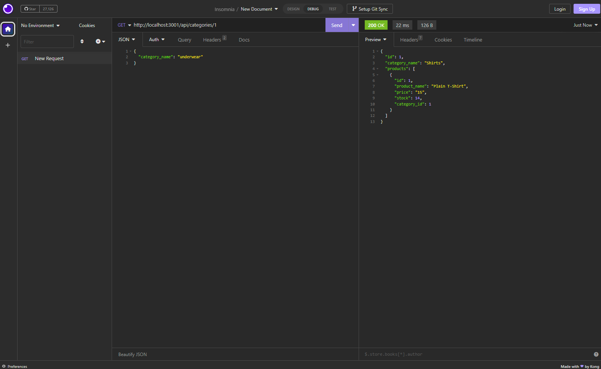

# eCommerceBackEnd
E-commerce Back End - Object Relational Mapping


# Acceptance Criteria 

```
GIVEN a functional Express.js API
WHEN I add my database name, MySQL username, and MySQL password to an environment variable file
THEN I am able to connect to a database using Sequelize
WHEN I enter schema and seed commands
THEN a development database is created and is seeded with test data
WHEN I enter the command to invoke the application
THEN my server is started and the Sequelize models are synced to the MySQL database
WHEN I open API GET routes in Insomnia Core for categories, products, or tags
THEN the data for each of these routes is displayed in a formatted JSON
WHEN I test API POST, PUT, and DELETE routes in Insomnia Core
THEN I am able to successfully create, update, and delete data in my database
```
# Usage/MockUp




# badges


# deployment/gitHub


ScreenRecordLink: https://drive.google.com/file/d/1aBM274Pnyx-mUJO0Ck96uibFRQ-fdNPX/view

gitHub: https://github.com/ricardoci/eCommerceBackEnd

